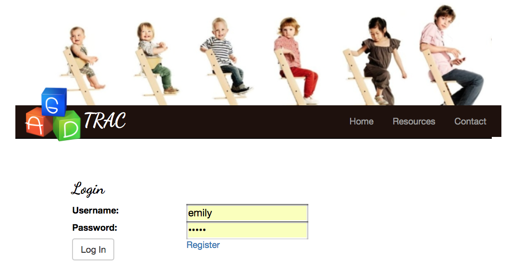
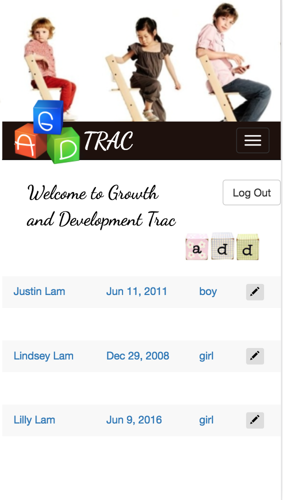
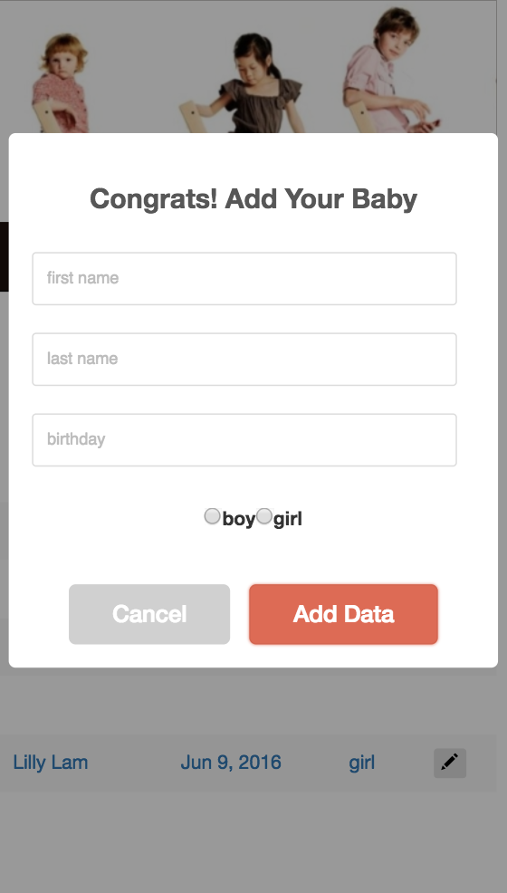
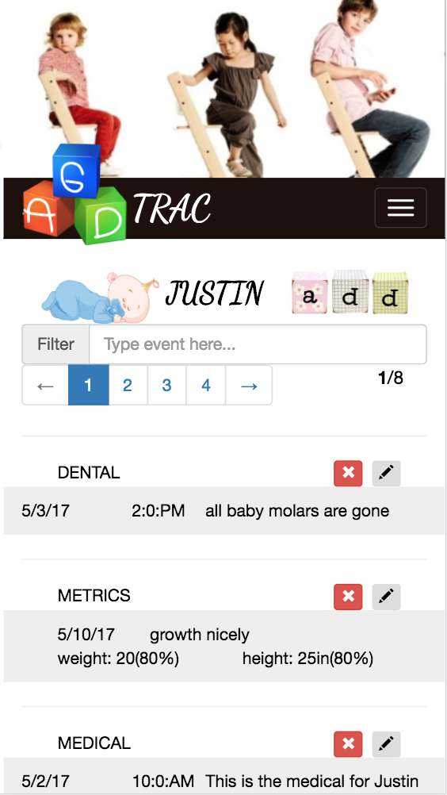
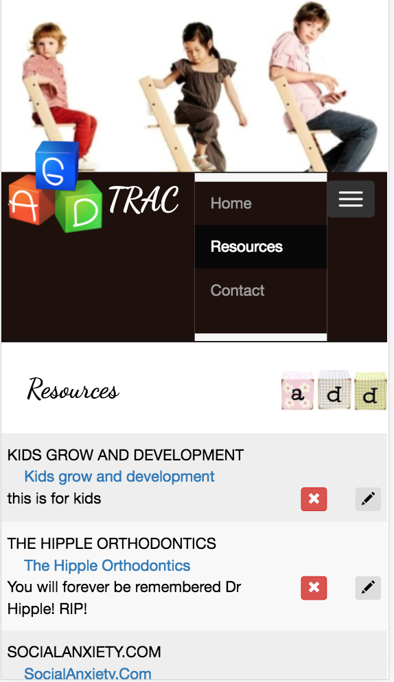

## GROWTH AND DEVELOPMENT (GAD) TRAC APPLICATION ##

 ##APP DETAIL##

* As being busy taking care of herself and her baby while trying to document her baby's growth development
* GAD (growth and development) app helps her to document all her baby's growth progress, baby's milestones, doctor notes, baby's metrics (weight/height/weight percentile, height percentile) and capture every amazing moments.
* Create a full stack application from the group up using the MEAN (Mongo, Express.js, AngularJs, and Node.js) to show the data and Bootstrap UI, Bootstrap Modal, SweetAlert 2, CSS3, and HTML5 to present the user interface.

 **Login page**
 * the new mother registers by her username and password after signing up successfully
 * it will take her back to login page

 **Info page**
 * after logging in successfully, she can have the options of adding a new child
 * she can also views the list of her children if she has added them before.

 **Detail page**
 * If she wants to document the particular child, she can click on the child name
 * it will take her to detail page where she can add and document that child's health, milestones, doctor notes, and the events her baby might have.
 * She can edit, add, or delete list of events.

 **Resource page**
 * List of all useful and educational resources that she likes to read
 * She can also to edit, add, or delete the resource

 **Contact page**
 * List of contacts: the address of the children's schools, activity location etc

**Stretch goal**
* Collecting the metrics information, the stretch goal is to build the growth chart that the mother could see how much her bay's growth is

  
 
     
 
