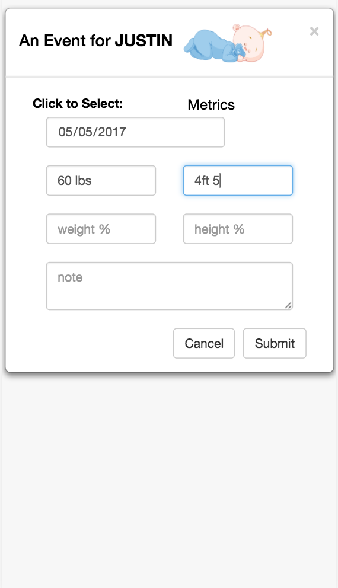

## GROWTH AND DEVELOPMENT (GAD) TRAC APPLICATION ##

 ## Application Detail

* As being busy taking care of herself and her baby while trying to document her baby's growth development
* GAD (growth and development) app helps her to document all her baby's growth progress, baby's milestones, doctor notes, baby's metrics (weight/height/weight percentile, height percentile) and capture every amazing moments.
* Create a full stack application from the group up using the MEAN (Mongo, Express.js, AngularJs, and Node.js) to show the data and Bootstrap UI, Bootstrap Modal, SweetAlert 2, CSS3, and HTML5 to present the user interface.

 ## Technologies Used 
 ```
 Mean (Mongo, Expressjs, Angularjs, Nodejs), Bootstrap Modal and UI, and SweetAlert2
 ```
 ## Installing:
 ```
* Clone the repo to your computer using git clone https://github.com/EmilyHHLam/SoloProject
* Run npm install
* Run grunt
* If running the app locally, ensure Mongo is running mongod
```
## Desktop View
  
 
 ## Mobile View
 

&nbsp;&nbsp;&nbsp;&nbsp;
<p><br></p>
&nbsp;&nbsp;&nbsp;&nbsp;
 
